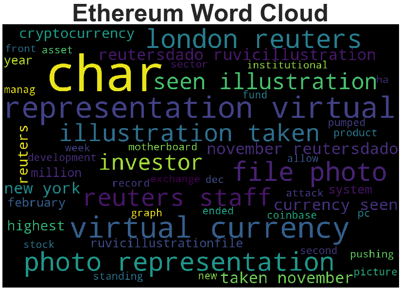

# NLP: Tales from the Crypto

 In this assignment, we applied natural language processing to analyze the sentiment in the latest news articles featuring Bitcoin and Ethereum. We started off by pulling the latest news articles on the two coins and created a DataFrame of sentiment scores for each coin. We used the descriptive statistics to answer the following questions:
 
 1. Which coin had the highest mean positive score?
 2. Which coin had the highest compound score?
 3. Which coin had the highest positive score?
 
 Ethereum was the highest for all three scores. Please see full document for explanation. 
 
 Next, we used NLTK and Python to tokenize the text for each coin. With that, we looked at ngrams and frequency for each coin. The top 10 words for each coin was then used to generate word clouds to summerize the news for each coin. Please see below.
 

